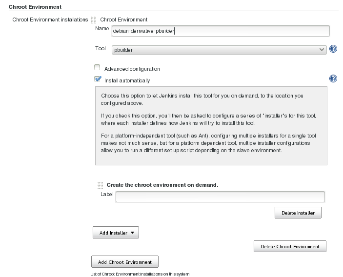
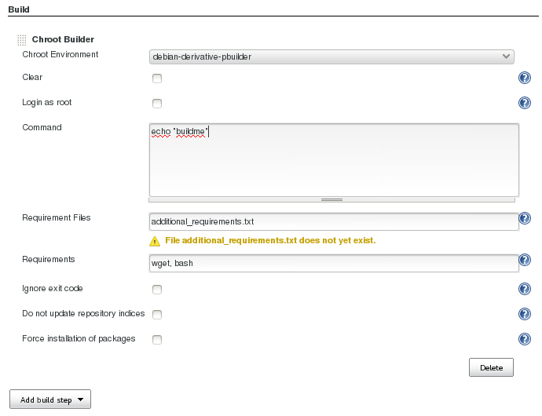

Chroot-plugin
=============

The aim of this jenkins plugin is to provide support for some chroot
environment technologies.  The first two environments to implement are pbuilder
and mock. This way a jenkins job can use it's own isolated chroot environment,
can install custom repositories and dependencies, and when the job is done, the
chroot environment ist thrown away. This feature makes jenkins much more
attractive as a build server for C and C++ projects.

Pbuilder works quite nice already. Mock is not useable at the moment.

Installation from Jenkins
-------------------------

Just install it like any other plugin: Chroot-plugin is available in the Jenkins Update Center.
An extensive plugin documentation can be found in the [Jenkins Wiki](https://wiki.jenkins-ci.org/display/JENKINS/chroot+Plugin).


Installation from source
------------------------

```bash
git clone https://github.com/rmohr/chroot-plugin
cd chroot-plugin
mvn install
```
You will find the resulting hpi file here: 
```
./target/chroot.hpi
```

Using pbuilder
--------------

To allow jenkins to use pbuilder it is necessary to that the jenkins user can
run /usr/sbin/pbuilder via sudo. Make sure to protect your jenkins installation
properly, because pbuilder is NOT a secure  and fully isolated
environment.

An appropriate /etc/sudoers entry might look like this:

```
jenkins ALL=(ALL) NOPASSWD: /usr/sbin/pbuilder
```

Using the plugin
----------------

First Create chroot environments in _Manage Jenkins_ > _Chroot Environments_:


**Make sure that the autoinstall option is enabled.**

A buildstep _chroot builder_ is now available where you can select a preconfigured builder:


Future Plans
------------
As the prove of concept phase is over, the next step is to clean the code and
create a clean interface for long term stability.
